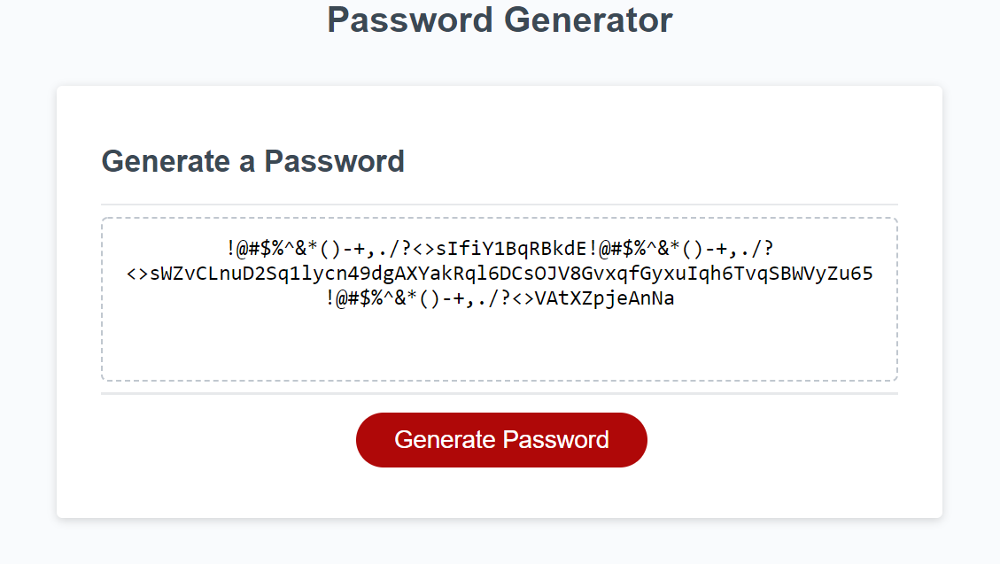

# Password-Generator

## Description

This a password generator made with Javascript. This website helps you create a secure password by adding factors that are decided by the user. The factors include character length, upper and lower case letters, numbers, and special characters.

## How It Works

When you click on a button, a prompt shows up asking how many characters you would like in your password. It ranges from 8-129. 

After this you will be asked multiple questions so you can customize your password however you like. The page will ask you if you need lower case letters, if you need upper case letters, if you need numbers, and if you need special characters in your password.

You must choose atleast one of the customizations, if you do not, the website will display another prompt asking you to choose.

Link to the GIT repository: https://github.com/mibrahim234/Password-Generator

Link to the Live Page: https://mibrahim234.github.io/Password-Generator/

## Credits: Mohammad Ibrahim 